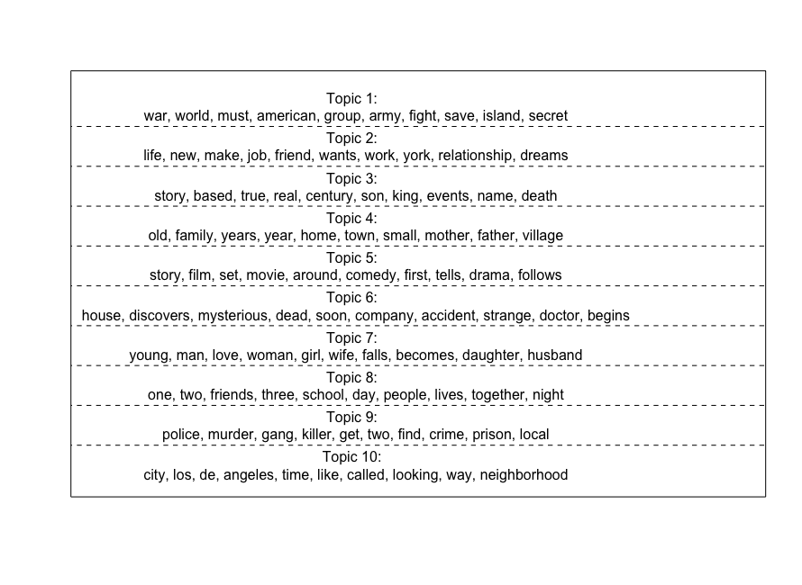

<br>

```{r setup, include=FALSE}

knitr::opts_chunk$set(echo = TRUE)

library(stargazer)
library(kableExtra)
```

```{css, echo = FALSE}

table, td, th {
  border: none;
  padding-left: 1em;
  padding-right: 1em;
  margin-left: auto;
  margin-right: auto;
  margin-top: 1em;
  margin-bottom: 1em;
}

```


This Data Analysis proposes models for predicting film quality based on certain metadata attributes and the text of the film’s IMDb description. We developed a topic model based on film descriptions from past years, and used this and other variables to develop models for predicting a film’s rating. We then tested the model’s validity on a set of freshly-scraped 2020 films. Ba Linh took the lead on text scraping, Anabel led the import and formatting the Kaggle data, and Adina focused on the topic model development. We were all actively involved in the final linear model development and testing.

Emails: 
a.spertus-melhus@mpp.hertie-school.org , b.le@mpp.hertie-school.org , a.berjon-sanchez@mpp.hertie-school.org 
<br> 
Full analysis code available at: https://github.com/adinaspertus/imdb
<br>
<br>
<br>

# 1. Process Overview 

The overarching goal of our project was to develop models to help predict a movie’s quality.  However, it’s hard to objectively judge a film’s “quality,” so in order to operationalize this variable, we relied on user-submitted film ratings (averaged on a scale of 1.0 – 10.0 stars) from the [Internet Movie Database (IMDb)](https://www.imdb.com/chart/moviemeter/?ref_=nv_mv_mpm). This database contains metadata on millions of films, TV titles, and video games, along with reviews provided by its tens of millions of users.  

To predict a film’s rating, we gathered information available from each film’s IMDb page to be used as independent model variables: film runtime in minutes, country of origin, and plot description. To incorporate a film’s description into our predictive model, we developed a topic model that analysed every film’s description and generated 10 different topic categories based on word associations. This provided 10 additional quantitative variables: how much each film fit into any of the given topic categories.  

We trained our predictive model on a list of 79,474 films downloaded from the [IMDb movies extensive dataset](https://www.kaggle.com/stefanoleone992/imdb-extensive-dataset). However, to test the validity of our model on more recent films, we also scraped the top 100 [most popular 2020 films](https://www.imdb.com/search/title/?year=2020&title_type=feature&) from IMDb. The details of our data collection, topic modelling, predictive model development, and final results are described further below.  

# 2. Research Questions

While our goal was to develop a predictive model for a film’s rating, we focused on several sub-questions to help us get there. Specifically: 

+ _Which film “topics” are associated with higher ratings, based on the film’s IMDb description? Specifically, are Romance movies and Action movies associated with higher ratings?_  

+ _Which country’s films are most highly rated if we were to compare movies from Canada, India, the UK, and the US?_  

+ _Do longer films get higher or lower ratings? What if a film is from India?_ 

+ _How does the effect of each topic on rating change when we hold country as a fixed effect constant?_ 

Additionally, the following research questions were developed after the topic model was created, and “Battle”, “Horror” “Romance” and “Crime” were assigned to Topics 1, 6, 7, and 9 (respectively).  

+ _Considering South Korea, Sweden, and Japan, three countries with a reputation for macabre cinema, who makes the best horror films?_  

+ _Does France or the UK make better romance films?_   

+ _Does Denmark or Sweden make better crime films?_ 

+ _How do Crime films and Battle (especially of the intergalactic variety) films from the US compare in quality to other films from the US, as well as Crime and Battle films from other countries?_ 

# 3. Data
##  3.1 Scraped Data

The test data for our predictive model was scraped from IMDb’s [Feature Film, Released between 2020-01-01 and 2020-12-31 (Sorted by Popularity Ascending)](https://www.imdb.com/search/title/?year=2020&title_type=feature&) list . (This list was selected due to the wide distribution of ratings compared to other 2020-based IMDb lists; “popular” is not the same thing as “highly rated” on IMDb.) Because we wanted to include at least 100 movies, two pages, each containing 50 movies, had to be scraped. 

Two methods were used for this process. The first method worked with the data that was already available in the list: title, year, actors, directors, and votes. The second method required a function that vectorizing a list of IMDb links, scraped the HMTL content from a given URL, called the node based on a specified xpath, and extracted attributes, text and tag names from that html node. This method had to be used for the following information: description, genre, plot keywords, country, gross, production company, runtime, rating, and meta score. 

After the extraction of the data, a cleaning process followed. In the end, the separate data frames were adjusted to fit the nature of the training dataset and combined to create the finished test dataset.  

##  3.2 Kaggle Data
The data to build our predictive model was downloaded from Kaggle. Among several datasets of scraped IMDb data, we first started to work with Satkar’s [IMDB_movie_1972-2019 dataset](https://www.kaggle.com/satkarjain/imdb-movie-19722019). We then realize it lacked specific variables that would be useful for our predictive model, like country of origin. Subsequently, we chose to work with Stefano Leone’s [IMDb movies extensive dataset](https://www.kaggle.com/stefanoleone992/imdb-extensive-dataset) based on its variables and size. This dataset includes 85,855 movies (all  with more than 100 votes as of 01/01/2020) with attributes such as movie description, average rating, number of votes, genre, etc. 

Using Kaggle data to build our model gave us the advantage of a large, tidy training dataset. After downloading and cleaning it, we adapted the data frame to contain the same variables as the scraped data, leaving us with 79,484 films to build our topic model and regressions from. 

# 4. Topic Model
Topic models are “statistical algorithms that analyze words in original text documents to uncover the thematic structure of the both the corpus and individual documents themselves” ([CFSS](https://cfss.uchicago.edu/notes/topic-modeling/), 2020). The benefit of topic models is that they do not require hand-coding of text material, because this categorization is derived from the model’s analysis of the text alone. 

We developed our topic model based on a large dataset of IMDb films dating back to 1894. After we selected films that contained data on our variables of interest (title, country of origin, description, and runtime) and removed any duplicates or non-English text, we were left with 79474 films to build our topic model from. We cleaned the text descriptions to remove words that don’t provide useful information like “the” and “and”. Next, we developed a corpus, which provides information on how many times each word appears in each film’s description. Using the STM package, we generated ten “topic” groupings based on the film’s description, as follows:  
<p>


```{r, echo = FALSE}
mod <- readRDS("data/topic_mod_v2.rds")

```

<center>**Top 10 Words with Highest Probability of Indicating each Topic**</center>

```{r, echo=FALSE, out.width = '100%'}

```


Based on each topic’s word bundles, we drew conclusions on which film “topics” it best fit with. For example, we concluded that Topic 1 correlated to battles, often of an intergalactic variety.  

Next, we gave each film a score (theta) along each topic that indicated how well it fit into that category. As expected, the films “Guardians of the Galaxy” and “The Avengers” had their highest scores for any of the ten topics under Topic 1 (theta = 0.428 and 0.572, respectively). We also classified Topic 6 as associated with horror films, Topic 7 as associated with romance films, and Topic 9 as associated with crime films. (Other topics clearly showed similarities, but couldn’t be categorized as easily into specific genres, such as Topic 4.) 

</center>**Possibly Associated Genres**</center>

```{r, echo = FALSE}
overview <- readRDS("data/overview_topics.rds")
overview %>% kbl()
```

Lastly, we created a corpus of our recently scraped IMDb data and assessed these films from 2020 along the same topic groupings. In doing so, we were able to give each film a rating for how well it fit each of our pre-established ten topics. This information was attached to the final 2020 film dataset to be used in our analysis.  

# 5. Model Development and Results

Finally, we developed several linear models to test our hypothesis. The independent variables of these models included: country (as a binary variable for specific countries), film runtime, and topic score (or “theta,” for each of the 10 topics). The dependent variable that the models were built to predict was the average user-provided IMDb rating, based on a scale of 1.0 to 10.0 stars.   

In this section we lay out the findings of the specific questions we explored.  

#### 1. Which film “topics” are associated with higher ratings, based on the film’s IMDb description? 

+ Hypothesis: Based on the film’s IMDb description, Romance (Topic 7) and Action-associated topics (Topics 1 and 9) will be associated with higher ratings.  

+ Result: Action-associated topics are associated with a decreasing effect on rating, whereas Romances are associated with an increasing effect on rating. The coefficients are statistically significant.  
<p>
<div align="center">

```{r, warning = FALSE, results = 'asis', echo = FALSE}
model1 <- readRDS("Tables/topics_only_model.rds") 
stargazer(model1, type = "html", 
          title = "Topic Model: Which Topics have better ratings?", 
          omit.stat=c("LL","ser","f","adj.rsq"), #omit character vector
          dep.var.labels.include = FALSE,
          column.labels = c("Rating"),
          header = FALSE,
          single.row = TRUE, 
          column.sep.width = "3pt")
```
<p>
#### 2. Which country’s films are most highly rated? We look specifically at films from: Canada, India, the UK, and the US.  

+ Hypothesis: American movies are most highly rated given Hollywood’s leading global role in media. 

+ Result: Indian movies are associated with the highest effect on rating, followed by decreasing effects on rating from British, American and lastly, Canadian movies. However, only the coefficients of American and Canadian movies are substantially significant (> 0.26).  
<p>


```{r, results = 'asis', warning = FALSE, echo = FALSE}
model2 <- readRDS("Tables/country_model.rds")
stargazer(model2, type = "html",  
          title = "Country Model: USA, India, UK, Canada and France", 
          omit.stat=c("LL","ser","f","adj.rsq"), 
          dep.var.labels.include = FALSE,
          column.labels = c("Rating"),
          header = FALSE,
          single.row = TRUE, 
          column.sep.width = "3pt")
```
<p>

#### 3. Do longer films get higher or lower ratings?  

+ Hypothesis: Longer films will have lower ratings (because the audience gets bored), but this effect will not hold for films from India because Bollywood films tend to be longer than films from other countries.  

+ Result: In contradiction to our prediction, we found that longer films are associated with a slightly higher ratings, however when films are from India, this effect is nearly erased (duration co-efficient = 0.002, compared to 0.016 for non-Indian films).  
<p>


```{r, results = 'asis', warning = FALSE, echo = FALSE}
model3 <- readRDS("Tables/duration_model.rds")
model3_india <- readRDS("Tables/india_len_model.rds")
stargazer(model3, model3_india, 
          type = "html", 
          title = "Duration Models", 
          omit.stat=c("LL","ser","f","adj.rsq"), 
          dep.var.labels.include = TRUE,
          column.labels = c("Duration", "Duration, India"),
          dep.var.labels = c("rating", "rating"),
          header = FALSE,
          single.row = TRUE, 
          column.sep.width = "3pt")
```
<p>

#### 4. How does the effect of each topic on rating change when we hold country as a fixed effect constant? 

+ Hypothesis: The basic topics model is suffering from omitted variable bias, which we remedy by focusing on within country variation. Therefore, we will observe changes in the coefficient estimates.  

+ Result: The intercept and the topic coefficient estimates changed. Therefore, we must suspect that OVB. However, holding only country constant presumes that the quality of country-specific productions stayed constant. However, this assumption might be unreasonable, given that some countries are as old as 1894. The results should be taken with a grain of salt.

```{r, results = 'asis', warning = FALSE}
# model4 <- readRDS("Tables/unit_fe_kaggle.rds")
# stargazer(model1, model4,
#           type = "html",  
#           title = "Comparison between Topics and FE Topics Model", 
#           omit.stat=c("LL","ser","f","adj.rsq"), 
#           dep.var.labels.include = FALSE,
#           column.labels = c("Topics Model", " FE Topics Model"),
#           header = FALSE,
#           single.row = TRUE, 
#           column.sep.width = "3pt")
```

*Note: The following hypothesis were developed after the model was created, and “Battle”, “Horror” “Romance” and “Crime” were assigned to topics 1, 6, 7, and 9 (respectively).*

#### 5. Considering South Korea, Sweden, and Japan, three countries with a reputation for macabre cinema, who makes the best horror films?  

+ Hypothesis: South Korean horror movies are most highly rated. 

+ Results: Non-horror movies from Japan have higher ratings than South Korean and Swedish films. On the other hand, horror movies from South Korea or Sweden are associated with an increasing effect on rating, whereas a Japanese horror film’s predicted rating will go down very slightly.  

+ However, although South Korean Horror films have the highest predicted rating out of the three countries (6.685), due to the lack of significant results (p = 0.01) for a country-horror interaction effect in Sweden or Japan, we avoid drawing conclusions on the superior horror producer.  

<p>
```{r, results = 'asis', warning = FALSE, echo = FALSE}
model5_sk <- readRDS("Tables/sk_horror_model.rds")
model5_sw <- readRDS("Tables/sweden_horror_model.rds")
model5_j <- readRDS("Tables/japan_horror_model.rds")
stargazer(model5_sk, model5_sw, model5_j,
          type = "html",
          title = "Who Makes Better Horror Movies? South Korea vs.Sweden", 
          omit.stat=c("LL","ser","f","adj.rsq"),
          dep.var.labels.include = FALSE,
          column.labels = c("Rating in SK", 
          "Rating in Sweden", "Rating in Japan"),
          header = FALSE,
          single.row = TRUE, 
          column.sep.width = "3pt")
```
<p>

#### 6. Does France or the UK make better romance films?  

+ Hypothesis: Considering its cultural symbolism as a romantic nation, French romances are associated with a stronger increasing effect on rating than British romances. 

+ Results: Contrary to our assumption, French romances have a statistically significant, negative effect on the rating. On the other hand, rating increases if a British movie turns out to be a romance. We should note however that while non-romance films from France out-perform British films in rating, these results barely miss the threshold for significance for the UK. 

<p>
```{r, results = 'asis', warning = FALSE, echo = FALSE}
model6_fr_ro <- readRDS("Tables/france_romance_model.rds")
model6_uk_ro <- readRDS("Tables/uk_romance_model.rds")
stargazer(model6_fr_ro, model6_uk_ro,
          type = "html", 
          title = "Who Makes Better Romance Movies? France vs.UK", 
          omit.stat=c("LL","ser","f","adj.rsq"), 
          dep.var.labels.include = FALSE,
          column.labels = c("Rating in France", "Rating in UK"),
          header = FALSE,
          single.row = TRUE, 
          column.sep.width = "3pt")
```
<p>

#### 7. Does Denmark or Sweden make better crime films (Topic 9)?  

+ Hypothesis: During the last decade in Europe, Denmark and Sweden have earned themselves the reputation of producing outstanding crime films.  However, considering Swedish fame in horror movies, Sweden probably also makes better crime films than Denmark.  

+ Results: Contrary to our prediction, Danish horror films have a higher predicted rating than Swedish ones. It should be noted that the interaction effect for Swedish horror films was small and statistically insignificant, compared to the much larger and statistically significant effect for Danish horror.

```{r, results = 'asis', warning = FALSE, echo = FALSE}
model7_dm <- readRDS("Tables/denmark_crime_model.rds")
model7_sw <- readRDS("Tables/sweden_crime_models.rds")
stargazer(model7_dm, model7_sw,
          type = "html", 
          title = "Who Makes Better Police Movies? Denmark vs.Sweden", 
          omit.stat=c("LL","ser","f","adj.rsq"), 
          dep.var.labels.include = FALSE,
          column.labels = c("Rating in Denmark", "Rating in Sweden"),
          header = FALSE,
          single.row = TRUE, 
          column.sep.width = "3pt")
```

#### 8. How do Battle films (especially of the intergalactic variety; Topic 1) and Crime films (Topic 9) from the US compare in quality to other films from the US, as well as Battle and Crime films from other countries? 

+ Hypothesis: Battle and Crime movies will both be more highly rated when they are from the US and they will do better than other US films because the US specializes in these type of violent action genres. 

+ Results: While both Battle and Crime genres are associated with lower ratings than other genres, American productions pertaining to these topics are associated with a positive rating boost. However, the interaction effect is only statistically significant for crime films, not battle films. 

As a second step, we attempted to verify some of our results from the 2020 scraped data. Because we only scraped 100 films, our testing abilities were limited. Nonetheless, we tested whether the following effects held on the more recent data. 

```{r, results = 'asis', warning = FALSE, echo = FALSE}
model8_us_crime <- readRDS("Tables/usa_crime_model.rds")
model8_us_battle <- readRDS("Tables/usa_battle_model.rds")
stargazer(model8_us_crime, model8_us_battle,
          type = "html", 
          title = "USA: Crime & Battle Movies", 
          omit.stat=c("LL","ser","f","adj.rsq"), 
          dep.var.labels.include = FALSE,
          column.labels = c("Rating of Crime Movies", 
          "Rating of Battle Movies"),
          header = FALSE,
          single.row = TRUE, 
          column.sep.width = "3pt")
```

#### 1. Which topics are associated with higher ratings in 2020? 

+ Hypothesis: We expect Topics 4, 7 (Romance), and 3 to be associated with the highest scores, and Topics 6, 8, 1 (Battle), and 9 (Crime) to have the lowest scores.  

+ Results: Presumably due to the small sample size, we did not find significant results in this area.   

<p>
```{r, results = 'asis', warning = FALSE, echo = FALSE}
model2020_1 <- readRDS("Tables/topics_scraped_model.rds")
stargazer(model2020_1, 
          type = "html",  
          title = "Topic Model 2020: Which Topics have better ratings?", 
          omit.stat=c("LL","ser","f","adj.rsq"), 
          dep.var.labels.include = FALSE,
          column.labels = c("Rating"),
          header = FALSE,
          single.row = TRUE, 
          column.sep.width = "3pt")
```
<p>

#### 2. Do longer firms have higher rating in 2020?  

+ Hypothesis: Longer films will have higher rating based on the trend found in previous years. 

+ Results: The substantially small but statistically significant positive correlation between duration and rating among 2020 films supports the hypothesis.  

<p>
```{r, results = 'asis', warning = FALSE, echo = FALSE}
model2020_2 <- readRDS("Tables/duration_model_2020.rds")
stargazer(model2020_2, 
          type = "html",  
          title = "Duration Model for 2020", 
          omit.stat=c("LL","ser","f","adj.rsq"), 
          dep.var.labels.include = FALSE,
          column.labels = c("Rating"),
          header = FALSE,
          single.row = TRUE, 
          column.sep.width = "3pt")
```
<p>

#### 3. Are British Romance movies better than the average British movie in 2020? 
*(Note: There were insufficient films from France in our 2020 sample set to compare these countries.) *

+ Hypothesis: In keeping with previous years’ results, we predict British Romance films to have higher ratings than British non-romance films. 

+ Results: Unfortunately, there was not sufficient data on British romance films to achieve significant results. However, the model suggests that on the 2020 dataset, Britain’s romance films were actually worse than their non-romance films. 

<p>
```{r, results = 'asis', warning = FALSE, echo = FALSE}
model2020_3 <- readRDS("Tables/uk_romance_model_2020.rds")
stargazer(model2020_3,
          type = "html", 
          title = "British Romance Films for 2020", 
          omit.stat=c("LL","ser","f","adj.rsq"), 
          dep.var.labels.include = FALSE,
          column.labels = c("Rating in UK"),
          header = FALSE,
          single.row = TRUE, 
          column.sep.width = "3pt")
```
<p>

#### 4. How do US Battle (Topic 1) and Crime (Topic 9) films compare to other US films, and films of these genres from other countries?  

+ Hypothesis: As found in previous years, we expect these genres of films to generally be associated with lower ratings, but their rating gets a boost when they are produced by the US.  

+ Results: While we did not find significant results, our hypothesis held for Crime films, but not Battle films (which had a negative interaction effect when from the US). 

<p>
```{r, results = 'asis', warning = FALSE, echo = FALSE}
model2020_4_uscrime <- readRDS("Tables/usa_crime_model_2020.rds")
model2020_4_usbat <- readRDS("Tables/usa_battle_model_2020.rds")
stargazer(model2020_4_uscrime, model2020_4_usbat,
          type = "html",
          title = "USA: Crime & Battle Movies for 2020", 
          omit.stat=c("LL","ser","f","adj.rsq"), 
          dep.var.labels.include = FALSE,
          column.labels = c("Rating of Crime Movies", 
          "Rating of Battle Movies"),
          header = FALSE,
          single.row = TRUE, 
          column.sep.width = "3pt")
```
<p>

#### 5. How does the effect of each topic on rating change when we hold country as a fixed effect constant? 

+ Hypothesis: The basic topics model is suffering from omitted variable bias, which we remedy by focusing on within country variation. Therefore, we will observe changes in the coefficient estimates.  

+ Result: The intercept and the topic coefficient estimates changed but the coefficient estimates stay statistically insignificant. 

<p>
```{r, results = 'asis', warning = FALSE, echo = FALSE}
model2020_5 <- readRDS("Tables/unit_fe_2020.rds")
stargazer(model2020_5, model2020_1,
          type = "html", 
          title = "Comparison between 2020 Topics Model and 2020 FE Topics Model", 
          omit.stat=c("LL","ser","f","adj.rsq"), 
          dep.var.labels.include = FALSE,
          column.labels = c("Topics Model", "FE Topics Model"),
          header = FALSE,
          single.row = TRUE, 
          column.sep.width = "3pt")
```
<p>

Ultimately, we were not able to validate many specific aspects of the model using our small sample of 2020 films, other than the positive correlation between film length and rating. Nonetheless, we demonstrate how one could scrape more recent IMDb data and apply it to existing models in order to validate the findings based on previous years. 

<p>

# 6.Conclusion
**In summary, each of our findings provides a small bit of insight into a particular dimension of how to predict a film’s quality. In the future, such insights could all go into a more robust algorithm for predicting a film’s quality based on various aspects of its metadata, including the text in its description.**